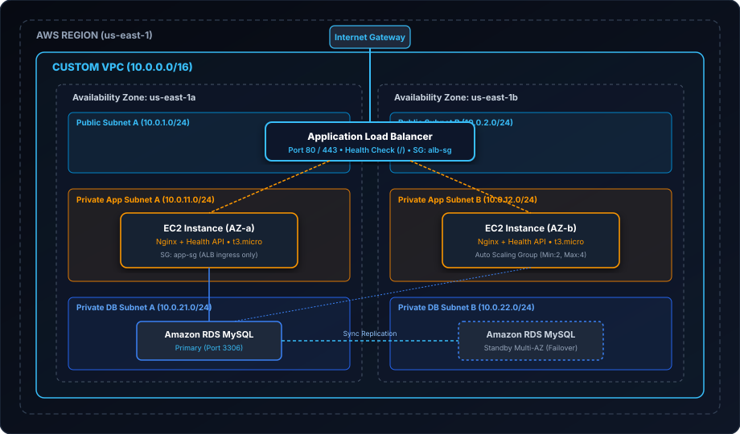

# Multi-Tier Highly Available & Resilient AWS Architecture with Terraform

[](https://www.terraform.io/)
[](https://aws.amazon.com/)
[](LICENSE)
[](troubleshooting-playbook.md)
[](#zero-cost--free-tier-deployment)

**Author:** [Cassiano Moura](https://linkedin.com/in/cassianomoura-tech)  
**Specialization:** Cloud Support Associate & Enterprise Technical Support Engineer (Tier 2/3)  
**Portfolio:** [https://cassianomoura.github.io](https://cassianomoura.github.io)

---

## 1. Executive Summary & Business Case

Enterprise organizations requiring high availability for mission-critical web applications cannot afford single points of failure (SPOFs) or exposed internal database endpoints.

This project delivers a **production-ready, multi-tier infrastructure deployed on Amazon Web Services (AWS) using Terraform**. It embodies the core tenets of the **AWS Well-Architected Framework**, featuring network segmentation across two Availability Zones, automated horizontal compute scaling, active load balancing, and a Multi-AZ relational database layer with strict zero-trust security group isolation.

### Key Business & Technical Objectives
* **Zero Downtime Redundancy:** Survives complete Availability Zone (AZ) failure without manual human intervention.
* **Network Isolation:** Public traffic is terminated strictly at the Application Load Balancer (ALB). Compute instances and database instances live in private subnets with no public IPv4 addresses.
* **Layered Least-Privilege Security:** Ingress rules strictly restrict traffic flow: `Internet` ➔ `ALB` ➔ `EC2 App Tier` ➔ `RDS MySQL`.
* **Zero Cost / Free-Tier Friendly:** Designed with `t3.micro` and `db.t3.micro` configurations, allowing recruiters and engineering managers to validate, plan, or test the infrastructure on AWS Free Tier or LocalStack at **$0 cost**.

---

## 2. Architecture Diagram



---

## 3. Infrastructure Component Breakdown

### 3.1 Network Tier (`vpc.tf`)
* **Custom VPC:** `10.0.0.0/16` with DNS hostnames and DNS resolution enabled.
* **Dual-AZ Redundancy:** Deployed across `us-east-1a` and `us-east-1b`.
* **Subnet Segmentation:**
  * **2 Public Subnets** (`10.0.1.0/24`, `10.0.2.0/24`): Hosts the external Application Load Balancer and Internet Gateway routing.
  * **2 Private Application Subnets** (`10.0.11.0/24`, `10.0.12.0/24`): Hosts EC2 instances running web application workloads.
  * **2 Private Database Subnets** (`10.0.21.0/24`, `10.0.22.0/24`): Isolated subnets for Amazon RDS MySQL Multi-AZ.

### 3.2 Compute & Auto Scaling Tier (`asg.tf`, `alb.tf`)
* **Application Load Balancer (ALB):** Publicly facing HTTP/HTTPS balancer performing continuous health probes (`GET /` every 30s) against target groups.
* **Launch Template:** Amazon Linux 2023 (`al2023-ami`), automated user data script bootstrapping Nginx and serving an instance metadata status endpoint.
* **Auto Scaling Group (ASG):** Spans both private application subnets. Configured with a minimum capacity of 2, maximum of 4, and dynamic target-tracking scaling policy maintaining average CPU utilization below 70%.

### 3.3 Data Tier (`rds.tf`)
* **Amazon RDS MySQL 8.0:** Multi-AZ deployment featuring a synchronous standby replica in the second AZ for automated failover.
* **Storage:** 20 GB General Purpose SSD (`gp3`), 7-day automated backup retention.
* **Subnet Isolation:** Dedicated `aws_db_subnet_group` preventing public IP allocation.

### 3.4 Layered Security Groups (`security_groups.tf`)
* **ALB Security Group (`alb-sg`):** Permits inbound ports 80/443 from `0.0.0.0/0`.
* **Application Security Group (`app-sg`):** Permits inbound port 80 **strictly from `alb-sg`**. Any direct connection attempt from outside is dropped.
* **Database Security Group (`db-sg`):** Permits inbound port 3306 (MySQL) **strictly from `app-sg`**. The database is completely unreachable from both the internet and the ALB.

---

## 4. Alignment with AWS Well-Architected Framework

| Framework Pillar | Architectural Implementation |
| :--- | :--- |
| **Reliability** | Multi-AZ redundancy across VPC, ALB, Auto Scaling EC2, and synchronous RDS standby replica. Automated failover and health recovery. |
| **Security** | Defense-in-depth: Private subnets, least-privilege security group referencing, no port 22 exposed to the public internet. |
| **Cost Optimization** | Parametric instance sizing (`t3.micro`), automated scaling down during low demand, single-command lifecycle disposal (`terraform destroy`). |
| **Operational Excellence** | Infrastructure as Code (IaC) with declarative Terraform modules, standardized resource tagging, and structured health-check endpoints. |

---

## 5. Enterprise Troubleshooting Playbook

What separates a standard code repository from an **Enterprise Support Engineer** portfolio is operational readiness. This project includes a comprehensive Tier-2 / Tier-3 incident response runbook:

👉 **[Read the Cloud Support Troubleshooting Playbook](troubleshooting-playbook.md)**

### Documented Scenarios:
1. **ALB Returning HTTP 502 / 504 Gateway Errors:** Root Cause Decision Tree, Target Group CLI commands, Nginx process diagnostics via AWS Systems Manager.
2. **Application Unable to Connect to RDS MySQL:** Forensic checklist, Security Group audits, private DNS resolution verification, and Multi-AZ failover connection pooling.
3. **EC2 Instances Failing Launch Health Checks:** Investigating `/var/log/cloud-init-output.log`, grace period tuning, and AMI compatibility.

---

## 6. Zero-Cost & Free-Tier Deployment Guide

### Prerequisites
* [Terraform CLI](https://developer.hashicorp.com/terraform/downloads) (>= 1.3.0)
* [AWS CLI](https://aws.amazon.com/cli/) configured with appropriate IAM credentials (`aws configure`)

### Step 1: Clone and Navigate
```bash
git clone https://github.com/cassianomoura/portfolio.git
cd portfolio/projects/project-1-ha-aws-terraform
```

### Step 2: Initialize Terraform
Downloads the latest AWS provider plugins:
```bash
terraform init
```

### Step 3: Validate Code Syntax
Ensures complete configuration validity:
```bash
terraform validate
```

### Step 4: Review Execution Plan (Cost $0)
Inspect all 25+ resources that will be provisioned:
```bash
terraform plan -out=deployment.tfplan
```

### Step 5: Deploy to AWS (Optional)
```bash
terraform apply "deployment.tfplan"
```

Once deployment completes, Terraform outputs the public ALB DNS:
```text
Outputs:
alb_dns_name = "enterprise-ha-platform-alb-123456789.us-east-1.elb.amazonaws.com"
rds_endpoint = "enterprise-ha-platform-db.c123456789.us-east-1.rds.amazonaws.com:3306"
```

### Step 6: Verify Live Health
Test the load balanced application across AZs:
```bash
curl -i http://<ALB_DNS_NAME>
```

### Step 7: Clean Up All Resources (Guaranteed $0 Leftover)
When finished testing, cleanly destroy all AWS resources in a single command:
```bash
terraform destroy -auto-approve
```

---

## 7. Repository Structure

```text
project-1-ha-aws-terraform/
├── README.md                     # Executive Documentation & Guide
├── troubleshooting-playbook.md    # Tier 2/3 Incident Response & RCA Playbook
├── main.tf                       # Provider configuration and default tags
├── variables.tf                  # Parameter definitions and Free-Tier defaults
├── vpc.tf                        # Multi-AZ VPC, Subnets, Route Tables & IGW
├── security_groups.tf            # Layered least-privilege Security Groups
├── alb.tf                        # Application Load Balancer & Target Group
├── asg.tf                        # Launch Template & Auto Scaling Group
├── rds.tf                        # Multi-AZ RDS MySQL Database Tier
├── outputs.tf                    # Public ALB DNS & internal endpoints
└── terraform.tfvars.example      # Example custom variables file
```

---

## 8. Author & Contact

**Cassiano Moura**  
*Cloud Support Associate & Enterprise Technical Support Engineer*  
* Email: [cassiano.moura.tech@gmail.com](mailto:cassiano.moura.tech@gmail.com)  
* LinkedIn: [linkedin.com/in/cassianomoura-tech](https://linkedin.com/in/cassianomoura-tech)  
* GitHub: [github.com/cassianomoura](https://github.com/cassianomoura)
