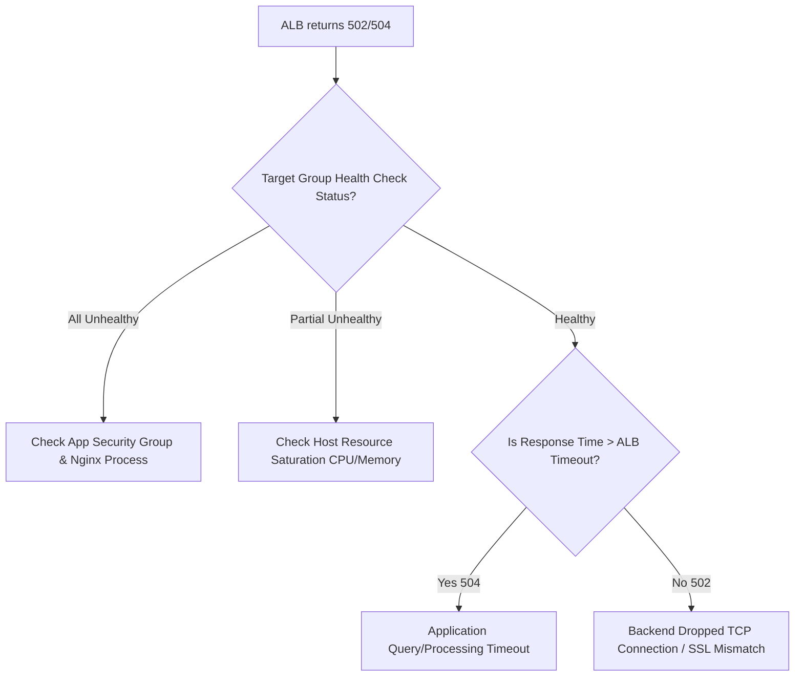

# Enterprise Cloud Support & Troubleshooting Playbook (Tier 2 / Tier 3)

**Author:** Cassiano Moura  
**Role Specialization:** Cloud Support Associate & Enterprise Support Engineer (Tier 2/3)  
**System Scope:** Multi-Tier Resilient AWS Architecture (`us-east-1`)  
**Standard Compliance:** ITIL Incident & Problem Management, Root Cause Analysis (RCA)  

---

## Executive Overview

In enterprise production environments, deploying infrastructure is only half the battle. High-performing Cloud Support and Application Support engineers are measured by their ability to rapidly diagnose, isolate, and mitigate outages while maintaining low **MTTR (Mean Time to Resolution)** and high **CSAT**.

This playbook documents standard operating procedures (SOPs), investigative commands, and remediation runbooks for the 3 most common critical incident scenarios affecting this multi-tier AWS architecture.

---

## Incident Scenario 1: ALB Returns HTTP 502 Bad Gateway / 504 Gateway Timeout

### 1. Initial Triage & Symptoms
* **Trigger:** Customer reports intermittent or continuous `HTTP 502 Bad Gateway` or `HTTP 504 Gateway Timeout` when accessing the ALB DNS endpoint.
* **CloudWatch Alarm:** `TargetConnectionErrorCount > 0` or `HTTPCode_Target_5XX_Count > 5`.

### 2. Root Cause Decision Tree



### 3. Step-by-Step Technical Investigation

#### Step 3.1: Check Target Group Health Status
Execute via AWS CLI:
```bash
aws elbv2 describe-target-health \
  --target-group-arn $(aws elbv2 describe-target-groups --names enterprise-ha-platform-tg --query 'TargetGroups[0].TargetGroupArn' --output text) \
  --output table
```
* **Expected Result:** `TargetHealth.State = healthy`.
* **If `unhealthy` with reason `Target.FailedHealthCheck`:** The EC2 instances are failing to respond with `HTTP 200` on the root path `/` within the 5-second timeout.

#### Step 3.2: Verify Layered Security Group Rules
Verify that the Application Security Group (`app-sg`) allows inbound port 80 **strictly** from the ALB Security Group (`alb-sg`):
```bash
aws ec2 describe-security-groups \
  --group-ids <APP_SECURITY_GROUP_ID> \
  --query 'SecurityGroups[0].IpPermissions'
```
* **RCA Check:** If an engineer accidentally deleted the rule or set an incorrect source security group, the ALB cannot reach instances, throwing immediate `502 Bad Gateway`.

#### Step 3.3: Inspect Web Server Process & Logs via AWS SSM
Do not require SSH (Port 22). Connect securely using AWS Systems Manager Session Manager:
```bash
# Check if Nginx is active
sudo systemctl status nginx

# Check local response
curl -I http://localhost:80/

# Inspect Nginx error logs for upstream drops or crash traces
sudo tail -n 50 /var/log/nginx/error.log
```

### 4. Immediate Remediation & Action Items
1. If Nginx crashed: `sudo systemctl restart nginx` and inspect memory limits with `free -m`.
2. If health check path changed in app code: update Target Group `health_check.path` to match the active health probe endpoint.
3. If CPU saturation is dropping connections: Trigger manual scaling or adjust Auto Scaling policy target CPU down to 60%.

---

## Incident Scenario 2: Application Cannot Connect to Multi-AZ RDS MySQL

### 1. Initial Triage & Symptoms
* **Trigger:** Web application logs report `OperationalError: (2003, "Can't connect to MySQL server on '...rds.amazonaws.com' (timed out)")`.
* **Impact:** High (N2/N3 Sev-1/Sev-2) — database transactions fail, affecting end users.

### 2. Forensic Diagnostic Checklist

| Checkpoint | Command / Console Location | What to Look For |
| :--- | :--- | :--- |
| **1. Database Status** | `aws rds describe-db-instances --db-instance-identifier enterprise-ha-platform-db` | Verify DB instance state is `available` (not in `maintenance` or `failing-over`). |
| **2. DB Security Group** | `aws ec2 describe-security-groups --group-ids <DB_SG_ID>` | Confirm port 3306 allows ingress from the Application Security Group ID (`app-sg`). |
| **3. Subnet Group Route Tables** | VPC Console → Route Tables | Ensure DB subnets (`10.0.21.0/24`, `10.0.22.0/24`) have private route tables and no conflict. |
| **4. DNS Resolution** | From EC2 instance: `nslookup <rds-endpoint>` | Ensure the endpoint resolves to an internal IP in the DB subnet CIDR range. |
| **5. Port Connectivity** | From EC2 instance: `nc -zv -w 3 <rds-endpoint> 3306` | Check if TCP handshake succeeds (`Connection to ... 3306 port [tcp/mysql] succeeded!`). |

### 3. Root Cause Analysis (RCA) Matrix

* **Root Cause A: Multi-AZ Failover in Progress**
  * *Finding:* During automated maintenance or an AZ outage, Amazon RDS initiates an automatic failover to the standby replica in the second AZ (`us-east-1b`).
  * *Investigation:* Failover typically takes 60–120 seconds. DNS record TTL for RDS is low (5 seconds), but application connection pools may cache stale socket descriptors.
  * *Remediation:* Implement client-side connection pooling with connection validation (`testOnBorrow = true`) and retry backoff in application code.
* **Root Cause B: Database Max Connection Exhaustion**
  * *Finding:* CloudWatch metric `DatabaseConnections` reached `max_connections`. New requests get rejected with connection timeouts.
  * *Remediation:* Kill idle sleeping threads: `SHOW PROCESSLIST;` and adjust MySQL parameter group `max_connections` or implement an AWS RDS Proxy.

---

## Incident Scenario 3: EC2 Instances Failing Auto Scaling Health Check at Launch

### 1. Initial Triage & Symptoms
* **Trigger:** Auto Scaling Group continuously launches new instances and terminates them immediately (`EC2 instance failed ELB health check`).
* **Symptom:** "Flapping" instances, Auto Scaling activity history shows frequent `Terminating EC2 instance: instance is unhealthy`.

### 2. Deep Dive Investigation Steps

#### Step 2.1: Check Cloud-Init User Data Logs
The Launch Template executes bootstrap scripts on initial boot. If the script fails (e.g. package mirror unreachable or syntax error in User Data):
```bash
# View boot output log
sudo cat /var/log/cloud-init-output.log | grep -E "(ERROR|Failed|fatal)"

# Check cloud-init status
cloud-init status --long
```

#### Step 2.2: Evaluate Health Check Grace Period
* *Issue:* The Auto Scaling Group health check grace period (`health_check_grace_period`) is set shorter than the time required for package installation (`dnf install -y nginx`).
* *Fix:* Increase grace period in `asg.tf` to `300` seconds (5 minutes) to give the operating system sufficient time to complete bootstrap routines before the ALB begins health evaluations.

---

## Post-Mortem & RCA Reporting Standard

Every critical incident handled must produce a formal Root Cause Analysis (RCA) report following this ITIL structure:

```markdown
# Incident Post-Mortem Report [INC-XXXXX]

## 1. Incident Overview
- **Incident Date & Time:** YYYY-MM-DD HH:MM UTC
- **Severity Level:** Sev-1 / Sev-2
- **Lead Investigator:** Cassiano Moura (Enterprise Technical Support)
- **Total Downtime (MTTR):** 14 minutes

## 2. Business Impact
- Impacted Services: Application User Authentication & Checkout
- Estimated Transactions Delayed: ~120
- Customer CSAT Impact: Mitigated via proactive status page notification

## 3. Timeline of Events
- 14:02 UTC - CloudWatch Target 5XX Alarm triggered.
- 14:04 UTC - Pager notification received, investigation started.
- 14:07 UTC - Isolated failing health checks on AZ-a instances via Target Group CLI.
- 14:11 UTC - Identified misconfigured Security Group egress rule after manual change.
- 14:14 UTC - Terraform state refreshed and re-applied; health checks passed (HTTP 200 OK).
- 14:16 UTC - Incident resolved; traffic normalized.

## 4. Root Cause Analysis (5 Whys)
1. Why did users receive 502 errors? Because the ALB found no healthy targets in AZ-a.
2. Why were targets unhealthy? Because the ALB health check timed out.
3. Why did it time out? Because the ingress rule on port 80 was removed during an ad-hoc test.
4. Why was it done manually? Lack of mandatory IaC pipeline guardrails.
5. Action: Enforce all Security Group updates strictly through Terraform CI/CD pull requests with approval.
```
