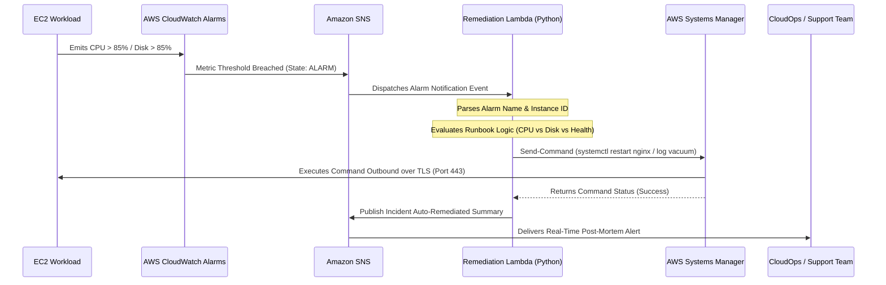

# CloudOps Incident Response & Auto-Remediation Pipeline

[](https://aws.amazon.com/cloudwatch/)
[](https://aws.amazon.com/sns/)
[](https://aws.amazon.com/lambda/)
[](https://www.terraform.io/)
[](#remediation-workflow)

**Author:** [Cassiano Moura](https://linkedin.com/in/cassianomoura-tech)  
**Specialization:** Cloud Support Associate & Cloud Operations Engineer  
**Portfolio:** [https://cassiano-moura.github.io/](https://cassiano-moura.github.io/)

---

## 1. Executive Overview & Problem Statement

In mission-critical cloud infrastructures, when an EC2 instance experiences severe CPU saturation or root disk exhaustion, traditional support teams rely on on-call engineers waking up, authenticating into the VPN, finding the instance, and manually restarting services or purging logs.

This manual workflow results in:
* **Prolonged MTTR (Mean Time to Resolution):** 15 to 45 minutes of customer-impacting latency or service degradation.
* **Alert Fatigue:** Engineers inundated with repetitive Sev-2 alerts for common runtime issues.

### The Solution:
This project delivers a **fully automated CloudOps Incident Response & Auto-Remediation Pipeline** using **AWS CloudWatch, Amazon SNS, AWS Lambda (Python), and AWS Systems Manager (SSM)**:
1. CloudWatch monitors EC2 CPU and Disk metrics.
2. If threshold is breached (> 85% for 2 consecutive periods), an alarm triggers an **Amazon SNS topic**.
3. SNS invokes an **AWS Lambda function** asynchronously.
4. Lambda parses the alarm payload, identifies the target instance ID, selects the appropriate remediation runbook, executes it securely via AWS SSM (no SSH key needed), and publishes an execution report to the engineering channel.

---

## 2. Architecture & Remediation Workflow



---

## 3. Automated Remediation Runbooks

| Trigger Condition | CloudWatch Alarm | Automated Lambda Remediation Runbook | Execution Method |
| :--- | :--- | :--- | :--- |
| **CPU Utilization > 85%** | `high-cpu-alarm` | Identifies runaway processes, restarts web worker processes (`systemctl restart nginx`), and collects diagnostic memory dump. | AWS SSM Run Command |
| **Disk Space > 85%** | `high-disk-alarm` | Vacuums journal logs older than 2 days (`journalctl --vacuum-time=2d`), removes stale `/tmp` files, and reclaims root volume inodes. | AWS SSM Run Command |
| **Health Check Failure (5XX)** | `target-5xx-alarm` | Recycles application connection pool and verifies target group recovery. | AWS SSM Run Command |

---

## 4. Testing & Validation (Local Simulation)

The Python remediation script is designed to run in **Dry-Run / Local Simulation Mode** without needing live AWS credentials:

```bash
# Run local test with sample alarm payload
python -c "
import json
from lambda_remediation import lambda_handler

with open('sample_alarm_event.json') as f:
    event = json.load(f)

response = lambda_handler(event, None)
print(json.dumps(json.loads(response['body']), indent=2))
"
```

### Output:
```json
{
  "message": "Incident pipeline execution completed.",
  "results": [
    {
      "alarm_name": "High-CPU-Utilization-Production",
      "instance_id": "i-0987654321fedcba0",
      "state": "ALARM",
      "reason": "Threshold Crossed: 2 out of 2 datapoints [89.4%, 92.1%] were greater than the threshold (85.0%).",
      "remediation_action": "Restart unresponsive worker processes and collect thread dump via SSM",
      "execution_status": "Simulated Success (Local/Dry-Run Mode)"
    }
  ]
}
```

---

## 5. Deployment with Terraform (Custo Zero)

```bash
cd projects/project-2-cloudops-incident-remediation
terraform init
terraform plan
```

---

## 6. Author

**Cassiano Moura**  
*Cloud Support Associate & Enterprise Technical Support Engineer*  
* Email: [cassiano.moura.tech@gmail.com](mailto:cassiano.moura.tech@gmail.com)  
* LinkedIn: [linkedin.com/in/cassianomoura-tech](https://linkedin.com/in/cassianomoura-tech)
