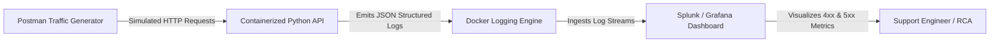

# API Troubleshooting & Observability Platform

[](https://www.docker.com/)
[](splunk_and_grafana_queries.md)
[](https://grafana.com/)
[](postman_collection.json)
[](#troubleshooting-workflow)

**Author:** [Cassiano Moura](https://linkedin.com/in/cassianomoura-tech)  
**Specialization:** Enterprise Application Support Engineer (Tier 2/3)  
**Portfolio:** [https://cassiano-moura.github.io/](https://cassiano-moura.github.io/)

---

## 1. Executive Summary & Problem Statement

In enterprise SaaS ecosystems (such as **SAP Ariba**, **Kraft Heinz supply chain**, and healthcare telemedicine), Tier-2 and Tier-3 support teams encounter daily incidents where integrations fail silently or degrade user experience.

### Common Enterprise Support Roadblocks:
1. **Unstructured Text Logs:** Plain text server logs make querying specific status codes (`401`, `500`, `504`) or payload error messages slow and prone to human error.
2. **Delayed MTTR:** Investigating transient gateway timeouts or authentication drops requires manual correlation across multiple log files.
3. **Lack of Proactive Error Rate Visibility:** Teams only discover outages when angry users file tickets, rather than receiving proactive metric threshold alerts.

---

## 2. The Solution Architecture

This project delivers a **containerized, end-to-end API Troubleshooting and Observability stack**:
* **Microservice API (`app.py` & `Dockerfile`):** Emits structured JSON logs containing `timestamp`, `trace_id`, `client_ip`, `endpoint`, `status_code`, and explicit `error_message`.
* **Traffic Simulation Suite (`postman_collection.json`):** Simulates real-world user traffic including healthy requests (`200`, `201`), client errors (`400`, `401`, `404`), server exceptions (`500`), and gateway timeouts (`504`).
* **Observability Dashboard & Analytics (`splunk_and_grafana_queries.md`):** Pre-built **Splunk SPL** queries and **Grafana dashboards** tracking 4xx/5xx error rates, P95 latency, and rogue client IPs.



---

## 3. Sample Structured Log Output

Unlike traditional raw Apache/Nginx logs, structured JSON logs allow instant indexing and zero-regex filtering:

```json
{
  "timestamp": "2026-09-20T14:32:01Z",
  "trace_id": "4b789a12-8e2b-42f1-b991-765f019a31bc",
  "service": "order-management-microservice",
  "method": "GET",
  "endpoint": "/api/v1/checkout/timeout-simulation",
  "status_code": 504,
  "client_ip": "172.18.0.1",
  "error_message": "Downstream MySQL query on orders table exceeded timeout",
  "tier": "Production-API"
}
```

---

## 4. Key Incident Scenarios Tested via Postman

| Request Name | Method & Endpoint | Expected HTTP Code | Simulated Enterprise Scenario |
| :--- | :--- | :---: | :--- |
| **Health Probe** | `GET /api/v1/health` | `200 OK` | Automated load balancer health check. |
| **Create Order** | `POST /api/v1/orders` | `201 Created` | Valid transaction with JSON body. |
| **Missing Field** | `POST /api/v1/orders` | `400 Bad Request` | Client omitted mandatory `customer_id`. |
| **Secure Endpoint** | `GET /api/v1/secure/data` | `401 Unauthorized` | Missing Entra ID Bearer token in headers. |
| **Server Crash** | `GET /api/v1/system/crash-simulation` | `500 Internal Error` | Unhandled NullPointerException in payment adapter. |
| **Gateway Timeout**| `GET /api/v1/checkout/timeout-simulation` | `504 Gateway Timeout` | Downstream SQL slow query exceeding 30s threshold. |

---

## 5. Splunk & Grafana Query Guide

👉 **[Read the Full Splunk & Grafana Observability Runbook](splunk_and_grafana_queries.md)**

### Highlights:
* **Splunk SPL:** Calculating 5-minute error rate distribution (`status_code >= 400`).
* **Root Cause Analysis (RCA):** Isolating top 10 failing endpoints by 5xx error volume.
* **Security & Auth Triage:** Tracking unauthorized spikes (`401 / 403`) from specific client IPs.

---

## 6. How to Run Locally (Zero Cost)

### Option A: Direct Python (No Docker Required)
```bash
cd projects/project-3-api-troubleshooting-observability
python app.py
```
Test with curl or Postman:
```bash
curl http://localhost:8080/api/v1/health
curl http://localhost:8080/api/v1/secure/data
```

### Option B: Docker Compose (Full Stack)
```bash
docker compose up --build
```
* API available at: `http://localhost:8080`
* Grafana available at: `http://localhost:3000` (User: `admin` / Password: `admin`)

---

## 7. Author

**Cassiano Moura**  
*Cloud Support Associate & Enterprise Technical Support Engineer*  
* Email: [cassiano.moura.tech@gmail.com](mailto:cassiano.moura.tech@gmail.com)  
* LinkedIn: [linkedin.com/in/cassianomoura-tech](https://linkedin.com/in/cassianomoura-tech)
