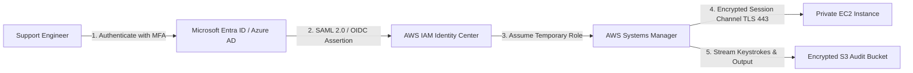

# Zero-Trust Enterprise Remote Access & Identity Governance

[](https://aws.amazon.com/systems-manager/)
[](https://csrc.nist.gov/publications/detail/sp/800-207/final)
[](https://www.terraform.io/)
[](#microsoft-entra-id-azure-ad-federation)

**Author:** [Cassiano Moura](https://linkedin.com/in/cassianomoura-tech)  
**Specialization:** Cloud Support Associate & Enterprise Technical Support Engineer (Tier 2/3)  
**Portfolio:** [https://cassiano-moura.github.io](https://cassiano-moura.github.io)

---

## 1. Problem Statement & Enterprise Governance

In traditional enterprise infrastructure, operations and support engineers managed remote Linux and Windows servers using **SSH (Port 22)** or **RDP (Port 3389)** via public Bastion Hosts (Jump Boxes).

### Critical Vulnerabilities & Operational Burdens:
1. **Attack Surface Exposure:** Exposing port 22 or 3389 to the internet invites constant automated brute-force attacks and port scanning.
2. **SSH Key Proliferation:** Managing `.pem` private keys across distributed teams creates compliance violations and offboarding risks (lost keys, unrotated credentials).
3. **Lack of Forensic Auditability:** Traditional SSH sessions lack centralized command logging, complicating SOC investigations and compliance audits (SOC2, ISO 27001, HIPAA).

---

## 2. The Solution: Zero-Trust Bastionless Management

This project provisions an enterprise **Zero-Trust Remote Management architecture** utilizing **AWS Systems Manager (SSM) Session Manager**:
* **0 Inbound Ports Open:** Security groups deny all inbound traffic. The EC2 instance communicates outbound over TLS (Port 443) to AWS SSM endpoints.
* **No Public IP Required:** Instances operate safely inside private subnets.
* **Centralized IAM & Role-Based Access Control (RBAC):** Access is governed by IAM policies linked to corporate identity providers (IdPs).
* **Immutable Session Auditing:** Every shell keystroke, command, and terminal output is encrypted (`AES-256`) and streamed to an isolated Amazon S3 audit bucket and CloudWatch Logs.

---

## 3. Microsoft Entra ID (Azure AD) Federation & SSO

As an engineer with hands-on corporate experience in **Microsoft Entra ID (SC-900 badge)**, this architecture is designed to integrate with corporate single sign-on (SSO):



### Governance Features:
* **Conditional Access:** Enforce device compliance, trusted corporate IP ranges, and mandatory MFA before session initialization.
* **Just-In-Time (JIT) Privileges:** Support engineers assume temporary STS credentials valid only for the duration of the incident ticket.
* **Automated Offboarding:** Revoking an engineer's Entra ID account instantly severs all access to cloud compute instances across all AWS accounts.

---

## 4. One-Click Command Line Access (No SSH Key Needed)

Support engineers connect directly using the AWS CLI:

```bash
# Connect to private instance by ID
aws ssm start-session --target i-0a1b2c3d4e5f67890

# Or execute a remote command without opening a terminal
aws ssm send-command \
  --document-name "AWS-RunShellScript" \
  --targets "Key=instanceids,Values=i-0a1b2c3d4e5f67890" \
  --parameters 'commands=["systemctl status nginx", "df -h"]'
```

---

## 5. Deployment Guide (Zero Cost)

```bash
cd projects/project-4-zero-trust-cloud-access
terraform init
terraform plan
```

---

## 6. Author

**Cassiano Moura**  
*Cloud Support Associate & Enterprise Technical Support Engineer*  
* Email: [cassiano.moura.tech@gmail.com](mailto:cassiano.moura.tech@gmail.com)  
* LinkedIn: [linkedin.com/in/cassianomoura-tech](https://linkedin.com/in/cassianomoura-tech)
